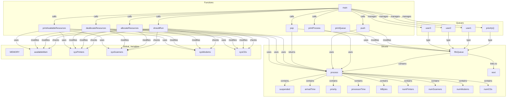

### Function and Variable Map

#### Global Variables (System Resources)
- **`MEMORY`**: Constant (1024) - Total system memory
- **`availableMem`**: Integer - Tracks remaining memory
- **`sysPrinters`**: Integer (initially 2) - Available printers
- **`sysScanners`**: Integer (initially 1) - Available scanners
- **`sysModems`**: Integer (initially 1) - Available modems
- **`sysCDs`**: Integer (initially 2) - Available CD drives

#### Structs
- **`process`**:
  - `suspended`: Boolean - Tracks if process has started
  - `arrivalTime`: Integer - Time process arrives
  - `priority`: Integer (0-3) - Process priority level
  - `processorTime`: Integer - Remaining execution time (seconds)
  - `MBytes`: Integer - Memory required
  - `numPrinters`: Integer - Printers requested
  - `numScanners`: Integer - Scanners requested
  - `numModems`: Integer - Modems requested
  - `numCDs`: Integer - CDs requested
- **`fifoQueue`**:
  - `proc`: `process` - The process stored in this node
  - `next`: `fifoQueue*` - Pointer to the next node in the queue

#### Queue Variables
- **`priorityQ`**: `fifoQueue*` - Queue for priority 0 (real-time) processes
- **`user1`**: `fifoQueue*` - Queue for priority 1 processes
- **`user2`**: `fifoQueue*` - Queue for priority 2 processes
- **`user3`**: `fifoQueue*` - Queue for priority 3 processes

#### Functions
- **`printProcess(process proc)`**:
  - Purpose: Prints details of a process
  - Inputs: `proc` (process struct)
  - Outputs: Console output
- **`push(process newProc, fifoQueue **headNode)`**:
  - Purpose: Adds a process to the end of a queue
  - Inputs: `newProc` (process to add), `headNode` (pointer to queue head)
  - Outputs: Modifies queue
- **`pop(fifoQueue **headNode)`**:
  - Purpose: Removes and returns the process from the front of a queue
  - Inputs: `headNode` (pointer to queue head)
  - Outputs: Returns `process`, modifies queue
- **`printQueue(fifoQueue *headNode)`**:
  - Purpose: Prints all processes in a queue
  - Inputs: `headNode` (queue head)
  - Outputs: Console output
- **`shouldRun(process toRun)`**:
  - Purpose: Checks if resources are available for a process
  - Inputs: `toRun` (process to check)
  - Outputs: Boolean
  - Dependencies: Uses `availableMem`, `sysPrinters`, `sysScanners`, `sysModems`, `sysCDs`
- **`allocateResources(process toRun)`**:
  - Purpose: Allocates resources for a process
  - Inputs: `toRun` (process to allocate for)
  - Outputs: Modifies `availableMem`, `sysPrinters`, `sysScanners`, `sysModems`, `sysCDs`
- **`deallocateResources(process toRun)`**:
  - Purpose: Frees resources used by a process
  - Inputs: `toRun` (process to deallocate)
  - Outputs: Modifies `availableMem`, `sysPrinters`, `sysScanners`, `sysModems`, `sysCDs`
- **`printAvailableResources()`**:
  - Purpose: Prints current available system resources
  - Inputs: None
  - Outputs: Console output
  - Dependencies: Uses `availableMem`, `sysPrinters`, `sysScanners`, `sysModems`, `sysCDs`
- **`main()`**:
  - Purpose: Orchestrates process scheduling
  - Inputs: None (reads from file)
  - Outputs: Executes processes, modifies queues and resources
  - Dependencies: Calls all other functions

---

### Mermaid Graph

Here’s a Mermaid graph to visualize the relationships between the structs, functions, and variables. You can paste this into a Mermaid-compatible editor (e.g., Mermaid Live Editor) to see the diagram.

